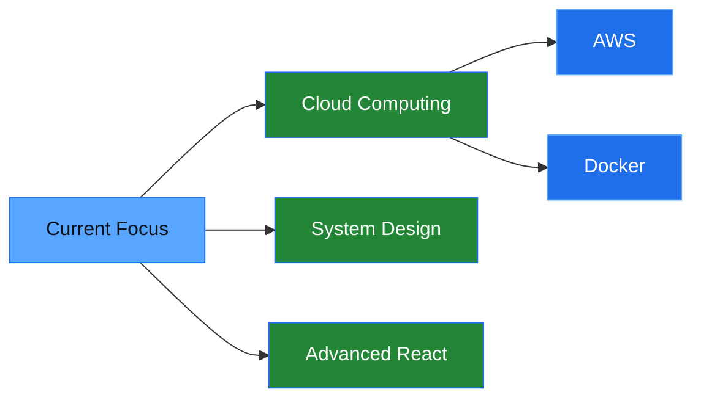

<div align="center">

# 👋 Hi, I'm Anas

### Junior Software Engineer | Problem Solver | Continuous Learner


</div>

---

## 🚀 About Me

```typescript
const developer = {
    name: "Anas",
    role: "Junior Software Engineer",
    passions: ["Clean Code", "Problem Solving", "Open Source"],
    currentFocus: "Full-Stack Development",
    lifePhilosophy: "Code. Learn. Repeat. 🔄"
};
```

---

## 🛠️ Tech Stack

<div align="center">

### Languages


### Frontend


### Backend


### Databases


### Tools & Technologies


</div>

---

## 📊 GitHub Stats

<div align="center">


</div>

---

## 🌱 Currently Learning

<div align="center">



</div>

- 🔭 Exploring **Cloud Technologies** (AWS, Docker, Kubernetes)
- 🌐 Building scalable **Full-Stack Applications**
- 📚 Studying **Data Structures & Algorithms**
- 🎯 Contributing to **Open Source Projects**

---

<div align="center">

### 💭 Random Dev Quote


</div>
